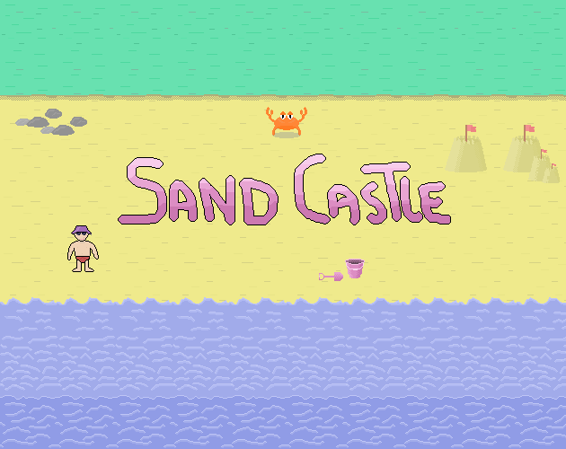

Sand Castle
===========

This is the source code of a Mini-Game made in 48h for Ludum Dare #50 game jam.

All is made using *aseprite* and *godot*.

The result is playable here : 

https://sdelay.itch.io/sandcastle

Enjoy!
